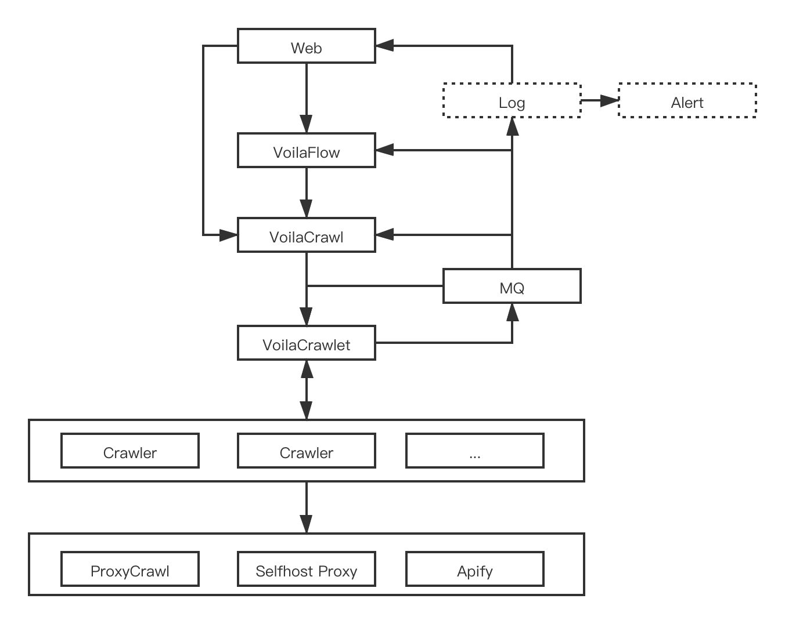

# VoilaCrawl

VoilaCrawl is a distributed spider platform. It's more like python scrapy except that VoilaCrawl is born to be distributed.

This repo mainly contains three parts: `crawl-api` and `crawlet` and `spiders`. Here is a simple sequence flow chart:

#### Features

1. distributed arch
2. microservice based spider
3. auto concurrency control
4. auto requests dispatch
5. data sharing bewteen `Request`
6. buildin http proxy support with Pigate
7. write spider with golang/python
8. cralwer health check
