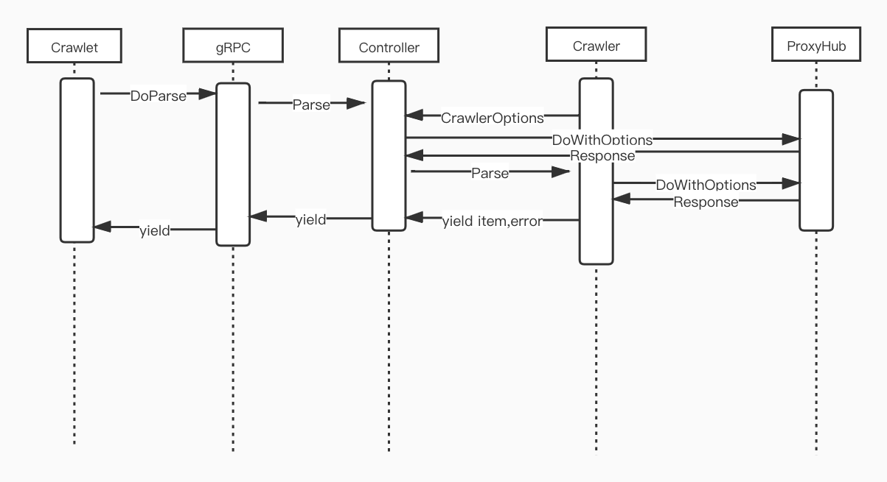

# VoilaCrawler

VoilaCrawler is a crawler/spider hub, includes spiders write in golang/python.

All crawlers must inherit base class/interface, which defined the protocol to communicate with crawler controller. Class/Interface defines see:

* [golang interface defined](pkg/crawler/spec.go)
* [python class defined](src/crawler/crawler.py)

In `Crawler` class/interface, `ID` is the id of the `StoreID`, which is generated in the store manage system. `Version` is used to version the crawler. when multi version crawers started, the `controller` will use the newest version to do other jobs.

When the crawler binary startup, it first start an gRPC service locally, then it register itself to `Crawlet` with local gRPC ip and port and other crawler info by dual stream grpc api.

After successfully registered, it gets requests from `crawlet` and then config request according to `CrawlerOptions`, then send the req to ProxyHub. More details are in the diagram.



### Data Sharing

`context.Context` is a magic package. i mainly used it to sharing data between requests. context is in an inheritance relationship. children can get values from parent ctx, but parents cannot get child shared values.

Because `VoilaCrawler` is a distributed crawl program. so it must serialize and deserialization shared data. **To simplify the deserialization, the values shared must be string type** Other types of shared values will be ignored when serialize.

### Errors

there are some buildin errors for crawlers to use:

* [go error](pkg/crawler/error.go)
* [python error](src/crawler/error.py)

these buildin errors simplified the way to triager error alert.

### HealthChecker

The `HealthChecker` is used to check if the target website data struct is changed. `NewTestRequest` returns one or more http.Request. `crawlet` will do http request with this params and pass the response to `CheckTestResponse`. `CheckTestResponse` should check key fields values. You can use Parser to extract data from this response and check if the key field's values is changed or is empty.

It's recommended that the requests returned by `NewTestRequest` is const, so that it's more easy to check.


#### Crawler test


TODO

### Development

All developers must develop with this workflow:
1. fork repo VoilaCrawler and clone the forked to your local
2. create/update spiders under dir bin
3. commit modification and create a merge request to `main` branch.


To build spiders, run:

```bash
make [lang=go|py] [target=com/asos]
```

where `lang` spiders the languate, `target` specifies the build target.

#### Local test

under the main dir, run

```bash
go run . test --debug --pretty --target "https://www.asos.com"
```

to do local test with current spider.


### TODO

1. remote function call
1. auto test alert
1. log viewer
